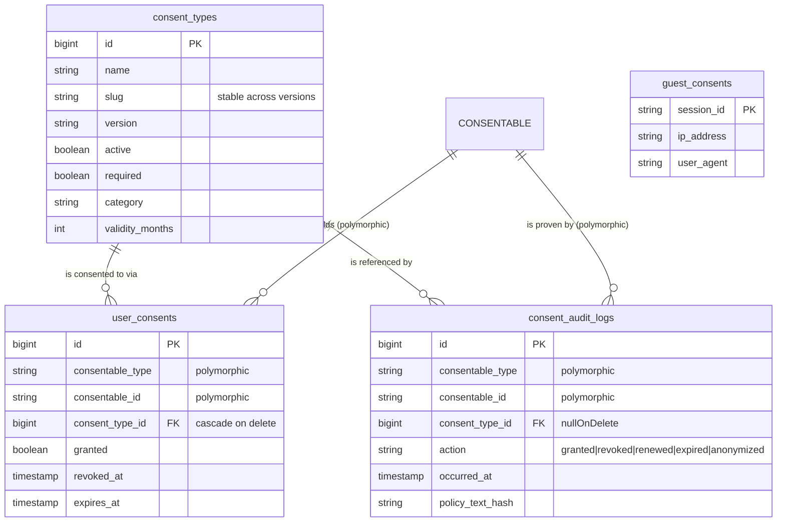

By the end of this page you will understand exactly how this package stores consent: the four database tables it creates, why it keeps a fast "what is true now" record separate from a permanent legal record, how *any* model in your app can hold consents, and how the `HasGdprConsents` trait is the single door you knock on to use all of it.

If you have never worked with GDPR consent before, start with [the start-here page](/getting-started/what-is-gdpr-consent) first. This page assumes you know what "consent" means in the abstract and now want to know how the package is built.

A quick vocabulary note, defined once and reused below:

- **Consent** — a person saying "yes, you may use my data for this specific purpose".
- **Consent type** — the *purpose* itself (for example "Marketing emails" or "Analytics cookies"). It is the thing a person consents *to*.
- **Consentable** — any model in your app that can hold consents (a `User`, a guest visitor, a team member). The name comes from Laravel's polymorphic relationships.
- **Eloquent** — Laravel's built-in tool for talking to database tables as PHP objects ("models").

---

## The big picture

The package installs **four tables** and gives you **one trait** to drive them. You almost never touch the tables or models directly — you add the trait to a model and call its methods.

::: callout info "The one rule to remember"
There are two kinds of consent record in this package. `user_consents` answers *"what is true right now?"* and can be changed. `consent_audit_logs` answers *"what happened, and can you prove it?"* and can **never** be changed. Keep these two ideas separate in your head and the rest of the architecture falls into place.
:::



`CONSENTABLE` in the diagram is not a real table — it is whatever model you attached the trait to (your `User`, a `GuestConsent`, etc.). The polymorphic columns let one table point at many different kinds of owner; more on that below.

---

## The four tables

### 1. `consent_types` — the catalogue of purposes

This is the master list of *what people can consent to*. One row describes one **version** of one purpose.

Built up across several migrations, a full row has these columns:

| Column | Type | What it is for |
| --- | --- | --- |
| `id` | bigint, primary key | Unique row id. |
| `name` | string | Human-readable name, e.g. "Marketing emails". |
| `slug` | string, indexed | A stable, code-friendly key like `marketing-emails`. **Deliberately not unique on its own** — it identifies the *group* of versions. |
| `description` | text, nullable | Optional longer description. |
| `required` | boolean, default false | Is this consent mandatory to use the service? |
| `active` | boolean, default true | Is this the live version of the group? |
| `category` | string, default `other` | Grouping label, e.g. `cookie`. |
| `legal_basis` | string, nullable | GDPR Art. 30 record-keeping. |
| `purpose` | text, nullable | GDPR Art. 30 record-keeping. |
| `data_controller` | string, nullable | GDPR Art. 30 record-keeping. |
| `policy_url` | string, nullable | The exact privacy policy shown for this version (GDPR Art. 7 proof). |
| `policy_text_hash` | string, nullable | A fingerprint of that policy text (GDPR Art. 7 proof). |
| `metadata` | json, nullable | Free-form extra data. |
| `version` | string, default `1.0` | This row's version within its slug group. |
| `validity_months` | integer, nullable | How many months a consent for this type lasts before it expires. `null` = never expires. |
| `effective_from` | timestamp, nullable | When this version starts being valid. |
| `effective_until` | timestamp, nullable | When this version stops being valid. |
| `created_at` / `updated_at` | timestamps | Standard Laravel timestamps. |

The database enforces that each `(slug, version)` pair is unique, and indexes `(slug, active)` so the package can find "the current version of this purpose" quickly.

::: callout note "Why one row per version, not one row per purpose?"
Privacy policies change. When your policy text changes, the *terms a person agreed to* change too — so a fresh agreement is needed. Instead of editing the old purpose in place (which would erase the evidence of what people originally agreed to), the package creates a **new version row** with the same `slug` and a higher `version`, then deactivates the old one. The full mechanics live on the [versioning](/concepts/versioning) page.
:::

### 2. `user_consents` — the current-state record

This is the fast "what is true right now" table. One row is one consentable model's standing on one consent type.

| Column | Type | What it is for |
| --- | --- | --- |
| `id` | bigint, primary key | Unique row id. |
| `consentable_type` | string | **Polymorphic** — the class of the owner (e.g. `App\Models\User`). |
| `consentable_id` | string | **Polymorphic** — the owner's id. |
| `consent_type_id` | foreignId | Which consent type this is about. **Cascades on delete.** |
| `consent_version` | string, nullable | The version of the consent type that was agreed to. |
| `granted` | boolean, default false | Is consent currently given? |
| `granted_at` | timestamp, nullable | When it was given. |
| `revoked_at` | timestamp, nullable | When it was withdrawn (`null` if still active). |
| `expires_at` | timestamp, nullable | When it auto-expires (`null` = never). |
| `ip_address` | string, nullable | IP captured at grant time. |
| `user_agent` | string, nullable | Browser/user agent captured at grant time. |
| `metadata` | json, nullable | Free-form extra data. |
| `created_at` / `updated_at` | timestamps | Standard Laravel timestamps. |

A composite index on `(consentable_type, consentable_id, consent_type_id)` makes "does this user have consent X?" lookups fast.

::: callout warning "This table is mutable — and that's the point"
Rows here get updated: `revoked_at` and `granted` change when consent is withdrawn. That is fine, because this table is only a *projection* of the current truth. It is built for speed, not for proof. The proof lives in the next table.
:::

### 3. `guest_consents` — anonymous visitors

Not every visitor has logged in. A guest still needs to be able to accept or reject cookies. This table stores those anonymous visitors, keyed by their session.

| Column | Type | What it is for |
| --- | --- | --- |
| `session_id` | string, **primary key** | The visitor's session identifier. Note: there is no auto-incrementing `id` — the session id *is* the key. |
| `ip_address` | string, nullable | Visitor IP. |
| `user_agent` | string, nullable | Visitor browser/user agent. |
| `metadata` | json, nullable | Free-form extra data. |
| `created_at` / `updated_at` | timestamps | Standard Laravel timestamps. |

`GuestConsent` is itself a consentable model — it uses the `HasGdprConsents` trait, so a guest holds consents through exactly the same machinery as a logged-in user. The model's `findOrCreateForSession()` helper resolves (or creates) the row for the current visitor, persisting a `gdpr_session_id` cookie for 30 days so the same guest is recognised on later visits.

### 4. `consent_audit_logs` — the immutable proof

This is the legal record: an **append-only** list of every consent action that ever happened. "Append-only" means rows are only ever *added* — never edited, never deleted.

| Column | Type | What it is for |
| --- | --- | --- |
| `id` | bigint, primary key | Unique row id. |
| `consentable_type` | string | **Polymorphic** — owner class. |
| `consentable_id` | string | **Polymorphic** — owner id. |
| `consent_type_id` | foreignId, **nullable** | Which consent type. **`nullOnDelete`** — see below. |
| `consent_type_slug` | string, nullable | The slug, copied in so proof survives even if the type row is gone. |
| `consent_version` | string, nullable | The version that was agreed to. |
| `action` | string | One of `granted`, `revoked`, `renewed`, `expired`, `anonymized`. |
| `occurred_at` | timestamp | When the action happened. |
| `ip_address` | string, nullable | IP at the time of the action. |
| `user_agent` | string, nullable | User agent at the time of the action. |
| `policy_url` | string, nullable | Snapshot of the policy URL shown. |
| `policy_text_hash` | string, nullable | Snapshot of the policy fingerprint shown. |
| `metadata` | json, nullable | Free-form extra data. |
| `created_at` | timestamp, nullable | When the row was written. There is **no `updated_at`** — the row never changes. |

Immutability is enforced in the `ConsentAuditLog` model itself: it hooks Eloquent's `updating` and `deleting` events and throws a `RuntimeException` on either. So ordinary application code physically cannot rewrite history through Eloquent. (This is an application-level guard, not a database guarantee; the [erasure](/concepts/erasure) path is the one sanctioned exception, which scrubs identifying columns to satisfy the right to be forgotten.)

The available action constants are defined on the model:

```php
<?php

use Selli\LaravelGdprConsentDatabase\Models\ConsentAuditLog;

ConsentAuditLog::ACTION_GRANTED;    // 'granted'
ConsentAuditLog::ACTION_REVOKED;    // 'revoked'
ConsentAuditLog::ACTION_RENEWED;    // 'renewed'
ConsentAuditLog::ACTION_EXPIRED;    // 'expired'
ConsentAuditLog::ACTION_ANONYMIZED; // 'anonymized'
```

The full story of how to read and trust this table is on the [audit trail](/concepts/audit-trail) page.

---

## The key idea: current state vs. immutable proof

This is the single most important architectural decision in the package, so it gets its own section.

GDPR Article 7(1) requires that, when consent is the legal basis for processing someone's data, you must be able to **demonstrate** that the person consented. Not just *claim* it — *prove* it, after the fact, possibly years later, possibly to a regulator.

A single mutable table cannot do this. If the only record of "user 42 consented to marketing" is a row you later flip to "revoked", you have destroyed the evidence that they ever consented in the first place. You can answer "what is true now?" but not "what happened, and when?".

So the package splits the job in two:

::: card "user_consents — the projection"
A fast, mutable snapshot of the present. "Does user 42 currently have active marketing consent?" is a single indexed query here. Rows change as consent is granted, revoked, and expires. Optimised for *reads in your app's hot path*.
:::

::: card "consent_audit_logs — the ledger"
A permanent, append-only history. Every grant, revoke, renew, expiry, and anonymization writes a new row that is never touched again. Optimised for *proof* — it is your answer to "show me the evidence" under Art. 7(1).
:::

::: callout success "Why the split is worth the extra table"
Because the two questions have opposite requirements. "What is true now?" wants speed and the freedom to change. "What happened?" wants permanence and the guarantee of *no* change. Trying to serve both from one table forces a bad compromise. Two purpose-built tables serve both perfectly — and they are kept in sync automatically by the trait, so you never write to the audit log by hand.
:::

---

## Polymorphism: any model can hold consents

A naive design would hard-code consents to belong to a `users` table. This package does not, because real apps have many kinds of consent holder: registered users, anonymous guests, maybe team members or organisations.

The solution is a **polymorphic relationship** — a Laravel feature where a child row records not just *which* owner it belongs to (`consentable_id`) but also *what kind* of owner (`consentable_type`, which stores the owner's class name). The pair together points unambiguously at any model anywhere in your app.

You opt a model in by adding the `HasGdprConsents` trait. That is the entire setup:

```php
<?php

namespace App\Models;

use Illuminate\Foundation\Auth\User as Authenticatable;
use Selli\LaravelGdprConsentDatabase\Traits\HasGdprConsents;

class User extends Authenticatable
{
    use HasGdprConsents;
}
```

That `User` can now grant, check, and revoke consent. The exact same trait is already used by the package's own `GuestConsent` model, which is why guests and users behave identically. A `TeamMember`, an `Organisation` — anything that is an Eloquent model — works the same way:

```php
<?php

namespace App\Models;

use Illuminate\Database\Eloquent\Model;
use Selli\LaravelGdprConsentDatabase\Traits\HasGdprConsents;

class TeamMember extends Model
{
    use HasGdprConsents;
}
```

::: callout tip "One trait, every owner type"
You never modify the package's tables to support a new kind of consent holder. You add the trait to the model and you are done. The polymorphic `consentable_type` / `consentable_id` columns on both `user_consents` and `consent_audit_logs` do the rest.
:::

---

## The trait is the API; the models are the engine

You drive everything through `HasGdprConsents`. The four models (`ConsentType`, `UserConsent`, `GuestConsent`, `ConsentAuditLog`) are the engine the trait operates — you rarely call them directly.

The trait defines two polymorphic relationships that connect your model to the two record tables:

```php
<?php

use App\Models\User;

$user = User::find(1);

// MorphMany<UserConsent> — this model's current-state consent rows.
$user->consents;

// MorphMany<ConsentAuditLog> — this model's immutable history,
// newest first (ordered by occurred_at desc, then id desc).
$user->consentAuditLogs;
```

- `consents()` returns a `MorphMany` of `UserConsent` rows — the current state for this owner.
- `consentAuditLogs()` returns a `MorphMany` of `ConsentAuditLog` rows — the proof for this owner, pre-sorted newest-first.

On top of those two relations the trait layers the methods you actually call day to day — `giveConsent()`, `revokeConsent()`, `renewConsent()`, `hasConsent()`, `activeConsents()`, `getMissingRequiredConsents()`, and more. A minimal example:

```php
<?php

use App\Models\User;

$user = User::find(1);

// Grant consent for the current version of the 'marketing-emails' purpose.
$user->giveConsent('marketing-emails');

// Later: is it still active?
if ($user->hasConsent('marketing-emails')) {
    // ...send the newsletter
}

// Withdraw it. Returns the number of consent records revoked.
$user->revokeConsent('marketing-emails');
```

Notice you passed a **slug** (`'marketing-emails'`), not a version id. The trait resolves a slug to the right consent-type version for you (current version when one is active, most recent historical version otherwise). You can also pass a numeric primary key if you have one.

---

## Foreign keys: cascade vs. nullOnDelete

The two record tables both point at `consent_types`, but they react *differently* when a consent type is deleted — and that difference is deliberate.

| Table | Foreign key behaviour | Why |
| --- | --- | --- |
| `user_consents.consent_type_id` | **`onDelete('cascade')`** | The current-state row is meaningless without its type. If the type is gone, the live consent goes with it. |
| `consent_audit_logs.consent_type_id` | **`nullOnDelete`** (column is nullable) | The proof must survive. If the type is deleted, the audit row stays; only the foreign key is set to `null`. |

The audit log can afford to lose the *link* to the consent-type row because it already copied the important details inline at write time — `consent_type_slug`, `consent_version`, `policy_url`, and `policy_text_hash` are all stored on the audit row itself. So even after the consent type is deleted, the proof of *what* was agreed to remains fully readable.

::: callout warning "Cascade deletes the current state, never the proof"
This is the foreign-key expression of the current-state-vs-proof split. Deleting a consent type wipes the fast projection (`user_consents`) but cannot wipe the ledger (`consent_audit_logs`). The history is designed to outlive the things it refers to.
:::

---

## Transactions and the single-active-consent invariant

The package guarantees an **invariant** — a rule that is always true — about `user_consents`:

> For any one consentable model and any one consent-type group (slug), there is **at most one active consent at a time**, regardless of how many versions exist.

In plain words: a user cannot simultaneously hold two live "marketing-emails" consents, even if your privacy policy has gone through five versions. There is exactly one current answer to "do they consent to marketing?", and the package keeps it that way.

How it holds the rule:

1. When you call `giveConsent()` (or `renewConsent()`), the work runs inside `persistConsent()`, which is wrapped in a database **transaction** (`DB::transaction`). A transaction means all the steps either succeed together or are rolled back together — there is no half-finished state.
2. Inside the transaction, `revokeConsentGroup()` runs **first**. It finds every active consent across *all versions* of that slug, locks those rows (`lockForUpdate`, which narrows the race window on MySQL/Postgres and is a harmless no-op on SQLite), writes a revoke entry to the audit log for each, and marks them revoked.
3. Only then does it create the **one** fresh consent row for the current version.

Because step 2 always clears the field before step 3 plants the new record — and both happen atomically inside one locked transaction — two concurrent grants cannot both end up active. The same `revokeConsentGroup()` logic powers `revokeConsent()`, so withdrawing consent is equally consistent.

::: callout info "Why a renewal is not just revoke-then-grant"
`renewConsent()` reuses the same supersede-the-group machinery, but records a single `renewed` audit entry instead of a revoke + grant pair. That keeps the [audit trail](/concepts/audit-trail) reading as *"the user renewed"* rather than the misleading *"the user withdrew, then consented again"*. Same invariant, clearer history.
:::

---

## Putting it together

- **Four tables.** `consent_types` (catalogue, one row per version), `user_consents` (mutable current state), `guest_consents` (anonymous holders), `consent_audit_logs` (immutable proof).
- **Two records, two jobs.** Current state for speed; the append-only ledger for Art. 7(1) demonstrability.
- **Polymorphism** lets any Eloquent model hold consents by adding one trait.
- **The trait is the only API you need.** Its `consents()` and `consentAuditLogs()` relations connect you to the engine, and its methods keep the two records in sync inside transactions that protect the single-active-consent invariant.

From here, go deeper on [versioning](/concepts/versioning), the [audit trail](/concepts/audit-trail), or [erasure](/concepts/erasure).
