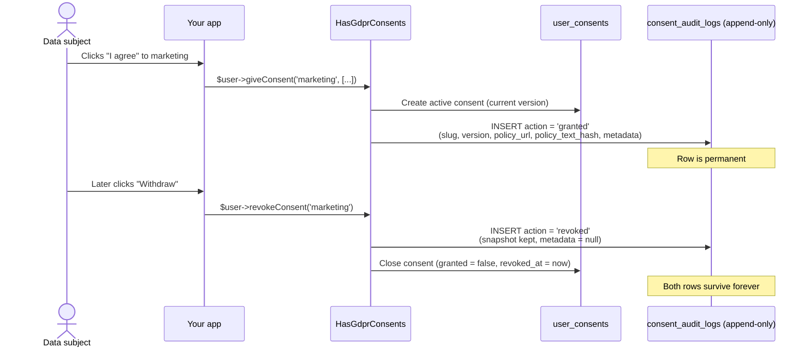

# The audit trail (proving consent)

This page explains the **audit trail**: the append-only log that this package keeps of every consent action. By the end you will know *why* it exists, *what* each entry records, *when* entries are written, and *how* to read them. No prior knowledge of the package is assumed.

A few terms up front, defined as we use them here:

- **Consent action** — a single thing that happened to a consent: it was granted, revoked, renewed, expired, or anonymised.
- **Audit trail** (also "audit log") — a chronological list of those actions. Once an entry is written it is never changed.
- **Append-only** — you can only *add* rows. You cannot edit or delete existing ones through normal application code.
- **Controller** — the GDPR term for the organisation that decides why and how personal data is processed. In practice: you, the operator of the app.
- **Data subject** (or just "subject") — the person the data is about: a user, a guest, a customer.

---

## Why the audit trail exists

::: callout info "The legal driver: GDPR Article 7(1)"
Article 7(1) of the GDPR says: *"Where processing is based on consent, the controller shall be able to **demonstrate** that the data subject has consented to processing of his or her personal data."*

The burden of proof is on **you**. If a regulator or the subject asks, you must be able to show that this specific person consented, **to what**, and **when** — not just claim it.
:::

Imagine you stored consent as a single boolean column, `marketing_opt_in = true`. When the user changes their mind, you flip it to `false`. Now the `true` is gone. You have no record that it was ever `true`, no record of *when* it became `true`, and no record of *what wording* the user agreed to at that moment. A mutable boolean cannot demonstrate anything — it only tells you the *current* state, and it lies about the past every time it changes.

The audit trail solves this. Every time a consent action happens, the package writes a new, permanent row describing it. The current state can change as often as it likes; the history stays intact. That history is your legal proof.

::: card "The one-sentence summary"
The audit trail turns "we think they agreed" into "here is the dated, versioned record of exactly what they were shown and what they did."
:::

---

## What each entry records

Every action produces one row in the `consent_audit_logs` table, represented by the `ConsentAuditLog` model. Here are the columns, taken directly from the migration.

| Column | Meaning |
| --- | --- |
| `consentable_type` | The class of the subject, e.g. `App\Models\User`. Part of the polymorphic link. |
| `consentable_id` | The id of the subject, e.g. the user's primary key. |
| `consent_type_id` | Foreign key to the exact consent-type version. Nullable. |
| `consent_type_slug` | A **snapshot** of the consent type's slug (its stable group identifier, e.g. `marketing`). |
| `consent_version` | A **snapshot** of the version string the action applied to, e.g. `2024-01`. |
| `action` | What happened: `granted`, `revoked`, `renewed`, `expired`, or `anonymized`. |
| `occurred_at` | When the action happened. |
| `ip_address` | The subject's IP at the time (nullable). |
| `user_agent` | The subject's browser/user-agent string at the time (nullable). |
| `policy_url` | A **snapshot** of the URL of the policy they were shown (nullable). |
| `policy_text_hash` | A **snapshot** hash of the policy *text* they were shown (nullable). |
| `metadata` | Free-form JSON captured with the action (nullable). |
| `created_at` | When the row was inserted. There is **no** `updated_at` — the row is never updated. |

::: note "Slug versus version"
A **slug** identifies a consent-type *group* — a purpose that stays the same over time, like `marketing`. A **version** identifies one specific revision of that purpose's policy, like `2024-01`. The same slug can have many versions over the years. Recording both means you know not just *which purpose* the person agreed to, but *which exact wording*.
:::

### The policy snapshot — proof of *what they were shown*

Article 7 requires consent to be **informed**: the person must have been told what they were agreeing to. It is not enough to prove they clicked "I agree" — you must prove what they were agreeing *to* at that moment.

Two columns capture this, and they are why this package can satisfy "informed":

- **`policy_url`** — where the policy lived when they consented.
- **`policy_text_hash`** — a fingerprint of the policy *text* itself.

A hash is a short fixed-length string computed from a piece of text; change one character of the text and the hash changes completely. So if you keep your historical policy texts, you can later prove "the policy at this URL, on this date, hashed to exactly this value, and that is the text the subject saw." If someone claims the policy was different, the hash either matches the archived text or it does not. This is the package's answer to the *informed* requirement.

::: tip "Keep your old policy texts"
The audit log stores the *hash*, not the full policy text. The hash is only useful as proof if you can still produce the original text it was computed from. Archive each policy version somewhere durable so you can re-hash it and show it matches.
:::

---

## When entries are written

Entries are written automatically by the consent methods on the `HasGdprConsents` trait (the trait you add to your `User` model), and by the scheduled expiry command. You do not write audit rows by hand. Here is the complete map.

| You call / event | Action recorded | Notes |
| --- | --- | --- |
| `giveConsent(...)` | `granted` | New consent for the current version. |
| `revokeConsent(...)` | `revoked` | One entry per active consent that was closed. |
| `renewConsent(...)` | `renewed` | A **single** `renewed` entry — not a revoke + grant pair. |
| `gdpr:consents:expire` command | `expired` | Written when a consent passes its expiry date. |
| `anonymizeConsents(...)` | `anonymized` | Written by the erasure path (see [erasure](/concepts/erasure)). |

The five action values are constants on the model, so you never type the raw strings:

```php
use Selli\LaravelGdprConsentDatabase\Models\ConsentAuditLog;

ConsentAuditLog::ACTION_GRANTED;    // 'granted'
ConsentAuditLog::ACTION_REVOKED;    // 'revoked'
ConsentAuditLog::ACTION_RENEWED;    // 'renewed'
ConsentAuditLog::ACTION_EXPIRED;    // 'expired'
ConsentAuditLog::ACTION_ANONYMIZED; // 'anonymized'
```

### Grant

```php
use App\Models\User;

$user = User::find(1);

// Records one 'granted' audit entry, snapshotting the current version's
// slug, version, policy_url and policy_text_hash.
$user->giveConsent('marketing', ['source' => 'signup_form']);
```

The `['source' => 'signup_form']` array is the `metadata`. It is stored both on the live consent and copied onto the `granted` audit entry.

### Revoke

```php
use App\Models\User;

$user = User::find(1);

// Records one 'revoked' audit entry for each active consent in the group.
$user->revokeConsent('marketing');
```

### Renew — and why it is a single `renewed` entry

When a policy gets a new version, or a time-limited consent is refreshed, you call `renewConsent(...)`. Internally this *does* supersede the old consent and create a fresh one — but it deliberately writes **one** `renewed` audit entry instead of a `revoked` entry followed by a `granted` entry.

::: callout warning "Why this matters for your proof"
A `revoked` entry in the trail reads as *"the subject withdrew their consent."* That is a meaningful, legally distinct event. If a renewal were logged as revoke + grant, your audit trail would falsely suggest the person withdrew and then re-consented, when in reality they simply continued under an updated policy. Recording a single `renewed` action keeps the story honest: continuity, not withdrawal.
:::

```php
use App\Models\User;

$user = User::find(1);

// Records exactly one 'renewed' audit entry. The previous consent is
// superseded internally, but no 'revoked' entry is written.
$user->renewConsent('marketing');
```

Under the hood this is controlled by two flags you will see if you read the trait: `persistConsent(...)` is called with an `auditAction` of `renewed`, and the supersede step is told *not* to record its usual revoke entry (`recordAudit: false`). The result is one clean `renewed` row.

### Expire

A consent can have an expiry date. Nothing happens automatically at that instant; instead you schedule the `gdpr:consents:expire` Artisan command (typically daily). It finds granted, non-revoked consents whose `expires_at` has passed, closes them, and writes an `expired` audit entry for each.

```bash
php artisan gdpr:consents:expire
```

### Anonymise

When you honour a Right to Erasure (Article 17) request via `anonymizeConsents(...)`, the package writes an `anonymized` entry. The erasure path is special and is covered in detail under [erasure](/concepts/erasure).

### What about metadata?

The `metadata` JSON is only carried onto **`granted`** and **`renewed`** entries — the actions where the subject actively provided context. A `revoked` entry is explicitly written with `null` metadata.

::: note "Why a revoke must not inherit the grant's metadata"
The metadata describes the *grant* — for example `['source' => 'signup_form']`. Copying that onto a `revoked` entry would misattribute the signup context to the withdrawal event, which never happened there. So the package strips it. (The `expired` entry also carries no metadata.)
:::

---

## How a grant and a revoke produce audit entries



The live `user_consents` row changes (granted, then closed). The audit log only ever **grows**: a `granted` row and then a `revoked` row, both kept permanently.

---

## Immutability — and an honest caveat

The `ConsentAuditLog` model blocks edits and deletes at the **application level**. In its `booted()` method it hooks Eloquent's `updating` and `deleting` events and throws a `RuntimeException` if anything tries to change or remove a row:

```php
// From ConsentAuditLog::booted()
static::updating(function (): void {
    throw new RuntimeException('Consent audit logs are immutable and cannot be updated.');
});

static::deleting(function (): void {
    throw new RuntimeException('Consent audit logs are immutable and cannot be deleted.');
});
```

The model also sets `public const UPDATED_AT = null;` — there is deliberately no `updated_at` column, because a row is never updated.

So in normal use, `$log->update([...])` or `$log->delete()` will throw. Your application code cannot quietly rewrite history.

::: callout warning "Be honest about what this guards"
This is an **application-level** guard, not a database-level guarantee. The model's own docblock spells it out:

> *"Immutability is enforced at the application level: any attempt to update or delete a record through Eloquent throws, so ordinary application code cannot rewrite the trail. This is a guard against accidental mutation, not a database-level guarantee — the only sanctioned exception is the erasure path (ConsentAnonymizer), which deliberately scrubs identifying columns via the query builder to satisfy Art. 17. For stronger tamper-evidence, revoke UPDATE/DELETE on the table at the database level or add a per-row hash chain in your application."*

Two practical consequences:
1. Anyone writing raw SQL, or using the query builder directly, can still bypass the Eloquent events. If you need true tamper-evidence, enforce it in the database (revoke `UPDATE`/`DELETE` on the table) or add a hash chain.
2. The **erasure path intentionally bypasses** the guard. It must, in order to scrub identifying columns for a Right to Erasure request — see below and [erasure](/concepts/erasure).
:::

---

## Proof survives consent-type deletion

A subtle but important design point: even if you delete a consent *type* from your system, the proof in the audit trail stays usable.

In the migration, the foreign key is declared as nullable with `nullOnDelete()`:

```php
// From the consent_audit_logs migration
$table->foreignId('consent_type_id')
    ->nullable()
    ->constrained('consent_types')
    ->nullOnDelete();
```

`nullOnDelete()` means: if the referenced consent type is ever deleted, this column is set to `NULL` rather than the audit row being destroyed. The row itself remains.

And because the slug, version, policy URL and policy hash were **snapshotted onto the audit row** at the moment of the action (rather than only being looked up by reference), they are still there after `consent_type_id` becomes `NULL`. You can still tell exactly which purpose, which version, and which policy the subject agreed to, long after the type record is gone.

::: tip "Snapshot, don't just reference"
This is the reason the audit table duplicates `consent_type_slug`, `consent_version`, `policy_url` and `policy_text_hash` instead of relying solely on the `consent_type_id` join. A reference can dangle; a snapshot is self-contained proof. See [architecture](/concepts/architecture) for how this fits the wider design.
:::

---

## Reading the trail

### From a subject

The trait adds a `consentAuditLogs()` relation to your model. It returns the entries **most-recent-first** — ordered by `occurred_at` descending, then `id` descending as a tie-breaker:

```php
use App\Models\User;

$user = User::find(1);

// Newest action first.
foreach ($user->consentAuditLogs()->get() as $log) {
    echo "{$log->occurred_at}  {$log->action}  "
       . "{$log->consent_type_slug} v{$log->consent_version}\n";
}
```

A common need — "show me everything that happened to this user's marketing consent":

```php
use App\Models\User;
use Selli\LaravelGdprConsentDatabase\Models\ConsentAuditLog;

$user = User::find(1);

$marketingHistory = $user->consentAuditLogs()
    ->where('consent_type_slug', 'marketing')
    ->get();
```

### Querying the model directly

You can also query `ConsentAuditLog` on its own — useful for compliance reports across all subjects:

```php
use Selli\LaravelGdprConsentDatabase\Models\ConsentAuditLog;

// Every grant of the 'marketing' purpose in 2026.
$grants = ConsentAuditLog::query()
    ->where('consent_type_slug', 'marketing')
    ->where('action', ConsentAuditLog::ACTION_GRANTED)
    ->whereBetween('occurred_at', ['2026-01-01', '2026-12-31'])
    ->orderByDesc('occurred_at')
    ->get();

// Reach back to the subject (polymorphic), and the consent type if it still exists.
foreach ($grants as $log) {
    $subject = $log->consentable;     // the User (or other model) who consented
    $type    = $log->consentType;     // may be null if the type was deleted
}
```

::: note "consentable and consentType can be null in old rows"
`consentable` resolves the subject via the polymorphic `consentable_type` / `consentable_id` columns. `consentType` resolves the type via `consent_type_id`, which is set to `NULL` once that type is deleted. When you need guaranteed-present proof, read the snapshot columns (`consent_type_slug`, `consent_version`, `policy_url`, `policy_text_hash`) rather than following the relation.
:::

---

## Putting it together

- GDPR Art. 7(1) makes **you** prove consent. A mutable flag cannot; an append-only log can.
- Each entry snapshots **who**, **what purpose** (slug), **what version**, **what policy** (URL + hash), **when**, and the **action**.
- Entries are written for you on grant (`granted`), revoke (`revoked`), renew (`renewed`), expiry (`expired`), and anonymisation (`anonymized`).
- A renewal is a single `renewed` entry so the trail does not read like a withdrawal.
- Rows are immutable at the application level — honestly, an *application-level* guard, with the erasure path as the one sanctioned exception.
- The proof survives consent-type deletion because the identifying fields are snapshotted onto each row.

For how erasure interacts with this trail, see [erasure](/concepts/erasure). For where the audit log sits in the overall design, see [architecture](/concepts/architecture). For the article-by-article picture, see the [GDPR mapping](/compliance/gdpr-mapping).
