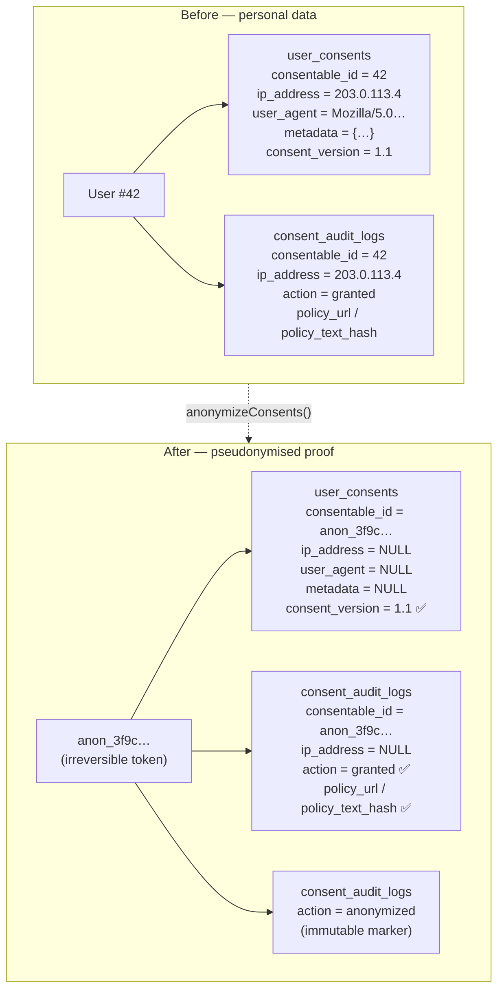

# Erasure & pseudonymisation

This page explains how the package handles an **erasure request** ("delete everything you have about
me") without throwing away the one thing GDPR forces you to keep: **proof that you had valid consent**.

If you only remember one sentence: **the package does not delete consent records — it pseudonymises
them.** The rest of this page explains what that means, why it is done that way, and exactly which
columns are touched.

::: callout warning "Not legal advice"
This page describes what the code does and the reasoning behind it. It is engineering documentation,
not legal advice. Confirm your erasure process with your own DPO or legal counsel.
:::

## The two rules that seem to contradict each other

First, two pieces of jargon, defined plainly:

- **Art. 17 — Right to erasure** ("right to be forgotten"): when a data subject asks, you must
  remove their **personal data**. Personal data is anything that can be linked back to a *natural
  person* (a real, identifiable human) — a name, an email, an IP address, and crucially their
  *identifier in your database*.
- **Art. 7(1) — Demonstrability of consent**: you must be able to **prove** that you obtained valid
  consent — what the person agreed to, which version of the policy, and when.

At first glance these are in direct conflict:

- Art. 17 says: *delete the person's data.*
- Art. 7(1) says: *keep the proof that the person consented.*

If you delete the consent record to satisfy Art. 17, you destroy your Art. 7(1) proof. If you keep
the full consent record to satisfy Art. 7(1), you are still holding the person's personal data after
they asked you to erase it. You cannot fully do both with a naive "DELETE the row".

## The resolution: pseudonymisation, not deletion

The package resolves the tension with **pseudonymisation**.

> **Pseudonymisation** = replacing the identifying data that links a record to a real person with an
> artificial identifier (a *pseudonym*), so the record can no longer be attributed to that person
> without extra information that you no longer hold.

The key insight: a consent record has **two kinds of data** mixed together.

| Kind | Examples | What we do with it |
|---|---|---|
| **Identifying** — links the record to a real human | `consentable_id`, `ip_address`, `user_agent`, `metadata` | **Scrub / replace** (Art. 17 satisfied) |
| **Demonstrative** — proves *what* was consented to | `action`, `consent_version`, `consent_type_slug`, `policy_url`, `policy_text_hash`, `occurred_at` | **Preserve** under the pseudonym (Art. 7(1) satisfied) |

By splitting the record this way, you keep the *fact* "someone validly consented to privacy-policy
v1.1 on 2026-06-27 under these exact policy terms" while making it **impossible to tell who that
someone was**. That preserved-but-anonymous record is no longer personal data, so holding it does not
violate Art. 17 — and it is still valid Art. 7(1) proof.

## Before & after



The proof columns (marked ✅) survive. Everything that pointed back at User #42 is gone or replaced.

## Exactly what `anonymize()` does

This is the whole of the erasure logic, performed inside a single database transaction (so it either
all happens or none of it does). It lives in
[`ConsentAnonymizer`](https://github.com/Sellinnate/laravel-gdpr-consent-database/blob/main/src/Services/ConsentAnonymizer.php).

### 1. Generate the pseudonym

When you do not supply one, the token is generated as:

```php
$token = 'anon_'.bin2hex(random_bytes(16));
// e.g. 'anon_3f9c1a7b8e2d4f60a1c5e9b7d3f02a6c'
```

This is `anon_` followed by 16 cryptographically random bytes rendered as 32 hex characters. It is
**irreversible** — it is random, not derived from the original id, so there is no key or algorithm
that turns `anon_3f9c…` back into `42`. That irreversibility is what makes the leftover record
genuinely non-personal.

### 2. Replace the identifier and scrub identifying columns

For both the `user_consents` and `consent_audit_logs` tables, every row belonging to the subject is
updated: the `consentable_id` is overwritten with the token, and `ip_address`, `user_agent` and
`metadata` are set to `NULL`.

```php
DB::table('user_consents')
    ->where('consentable_type', $consentableType)
    ->where('consentable_id', $id)
    ->update([
        'consentable_id' => $token,
        'ip_address'     => null,
        'user_agent'     => null,
        'metadata'       => null,
    ]);
// …same update applied to consent_audit_logs
```

Notice what is **not** in that list: `action`, `consent_version`, `consent_type_slug`, `policy_url`,
`policy_text_hash`, `occurred_at`. Those are deliberately left untouched — they are the proof.

### 3. Scrub the guest row too (for guest subjects)

A subject may itself be a `GuestConsent`, whose own row (keyed by `session_id`) holds identifying
data. The anonymiser scrubs that row as well, so nothing is left to re-link the pseudonym to the
original session:

```php
DB::table('guest_consents')
    ->where('session_id', $id)
    ->update([
        'ip_address' => null,
        'user_agent' => null,
        'metadata'   => null,
    ]);
```

For a non-guest subject (e.g. a `User`) there is simply no matching `session_id`, so this update
affects zero rows — it is harmless.

### 4. Write an immutable `anonymized` marker

Finally a new audit entry is written **under the pseudonym**, recording that anonymisation happened
and how many rows it touched. Its `action` is `ConsentAuditLog::ACTION_ANONYMIZED` (`'anonymized'`):

```php
ConsentAuditLog::create([
    'consentable_type' => $consentableType,
    'consentable_id'   => $token,
    'action'           => ConsentAuditLog::ACTION_ANONYMIZED,
    'occurred_at'      => now(),
    'ip_address'       => null,
    'user_agent'       => null,
    'metadata'         => [
        'consents_anonymized'   => $consents,
        'audit_logs_anonymized' => $auditLogs,
    ],
]);
```

This gives you a tamper-evident record that the erasure request was honoured, without naming anyone.

## Why it bypasses the immutability guard (and why that's intentional)

The [audit trail](/concepts/audit-trail) is **immutable**: the `ConsentAuditLog` model throws a
`RuntimeException` if you try to `update()` or `delete()` an entry through Eloquent. That guard exists
so ordinary application code can never quietly rewrite history.

But erasure *must* modify those rows — that is the whole point. So the anonymiser deliberately uses
the **query builder** (`DB::table(...)->update(...)`) instead of Eloquent. The query builder does not
fire Eloquent model events, so the `updating` guard never runs.

This is not a loophole — it is a single, controlled, documented exception. The in-code comment states
the reasoning plainly:

> Bypass the audit log's Eloquent immutability guard intentionally: erasure is a legal obligation that
> overrides tamper-protection, and this is the single controlled path allowed to scrub identifying data
> while keeping the proof intact.

In other words: the immutability guard protects against *accidental* tampering by application code;
erasure is a *deliberate legal override* and is the only sanctioned path that crosses that line.

## The return shape

Both entry points return the same array:

```php
[
    'token'      => 'anon_3f9c1a7b8e2d4f60a1c5e9b7d3f02a6c', // the pseudonym used
    'consents'   => 3,  // rows updated in user_consents
    'audit_logs' => 7,  // rows updated in consent_audit_logs
]
```

Keep the `token` if you ever need to locate the (now anonymous) proof records again — it is the only
handle that remains.

## How to use it

### From a model

Any model using the `HasGdprConsents` trait — including `GuestConsent` — exposes
`anonymizeConsents()`:

```php
use App\Models\User;

$user = User::find(42);

$result = $user->anonymizeConsents();
// ['token' => 'anon_…', 'consents' => 3, 'audit_logs' => 7]

// Or pass your own pseudonym (e.g. a case reference) instead of a random one:
$result = $user->anonymizeConsents('erasure-case-2026-0042');
```

Under the hood this resolves `ConsentAnonymizer` from the container and calls `anonymizeModel($this)`,
which uses the model's **morph class** as the `consentable_type` and its **primary key** as the id.

### From the command line

When you do not have the model handy (e.g. the user row is already gone), use the Artisan command:

```bash
# type = the stored consentable type (morph alias OR fully-qualified class name)
# id   = the subject identifier (the model's key)
php artisan gdpr:anonymize-subject "App\Models\User" 42

# A guest is keyed by its session id:
php artisan gdpr:anonymize-subject "guest" "sess_abc123"

# Supply an explicit pseudonym instead of a random one:
php artisan gdpr:anonymize-subject "App\Models\User" 42 --token="erasure-case-2026-0042"
```

- **`type`** must match exactly what is stored in the `consentable_type` column. That is your
  configured morph alias if you use one, otherwise the fully-qualified class name.
- **`id`** is the subject's key — an integer primary key for a `User`, or the `session_id` string for
  a guest.
- **`--token`** is optional; omit it to get a random `anon_…` pseudonym.

The command prints a confirmation table with the pseudonym and the two row counts.

## Caveats — read these before you run it

::: callout warning "Metadata is cleared — capture analytics first"
Because callers may have stored personal data inside consent `metadata`, anonymisation sets it to
`NULL` everywhere. If you rely on **non-personal** metadata for analytics or reporting, you must
capture or aggregate it somewhere else **before** erasing the subject. There is no way to recover it
afterwards.
:::

::: callout warning "Erasing the rest of the subject is your job"
The package only erases the **consent data it owns** (`user_consents`, `consent_audit_logs`, and the
`guest_consents` row). Deleting the underlying `User` model, and any other PII stored elsewhere in
your application, remains **your responsibility**. A complete Art. 17 workflow usually pseudonymises
the consent data with this package *and* removes the natural person's record and data from the rest of
your system.
:::

After anonymisation, the original subject has **no retrievable consent records** — querying by the old
id returns nothing — and the remaining proof can no longer be linked to the natural person.

## Related

- [Audit trail](/concepts/audit-trail) — the immutable record and the guard that erasure overrides.
- [Data subject rights](/compliance/data-subject-rights) — erasure in the context of access,
  portability and withdrawal.
- [GDPR mapping](/compliance/gdpr-mapping) — article-by-article overview of how the package complies.
