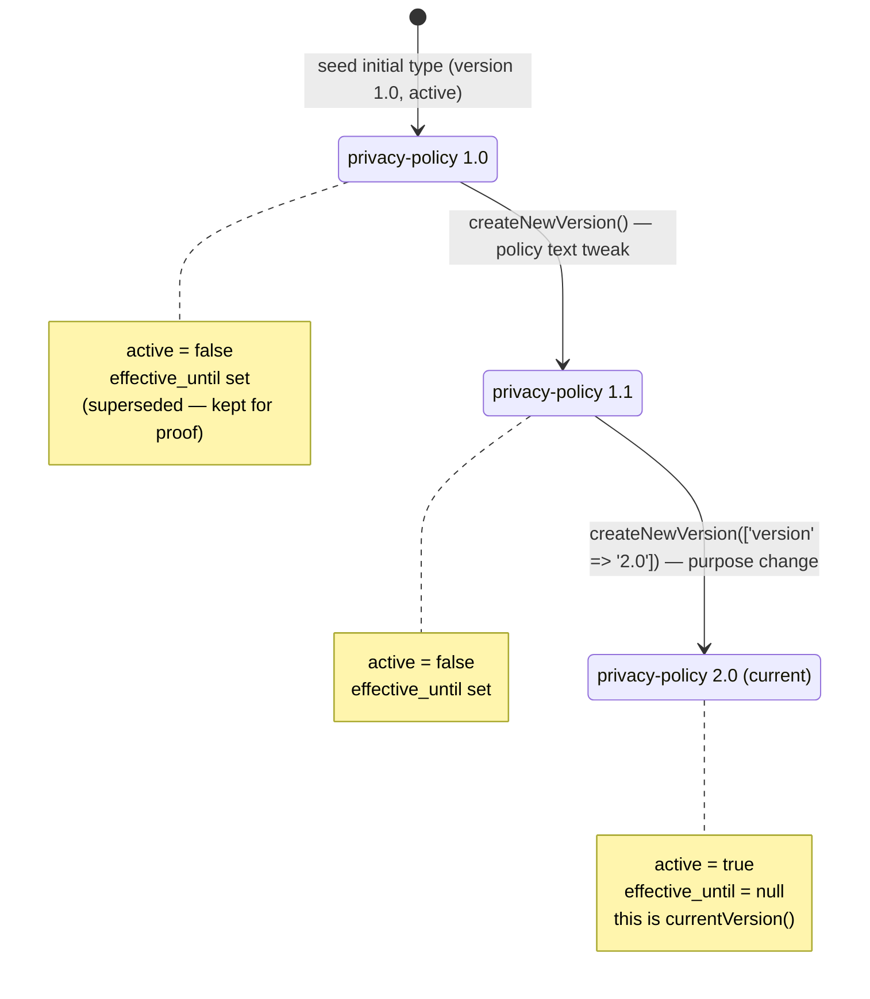
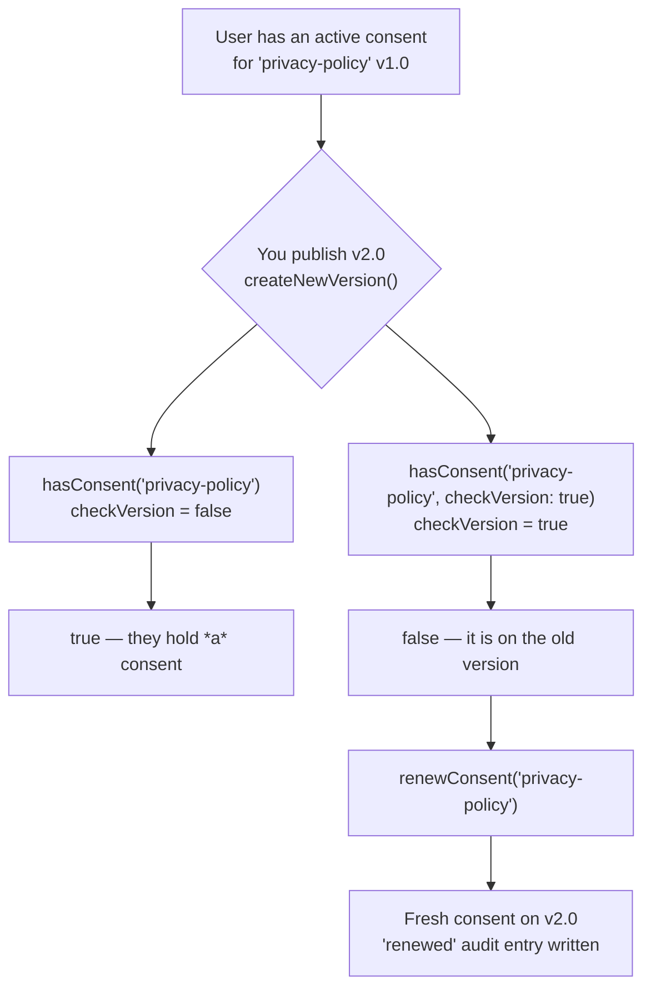

# Versioning & re-consent

When you change *what* you do with someone's data, or *why* you do it, the consent
they gave you yesterday no longer covers what you want to do tomorrow. This page
explains how `selli/laravel-gdpr-consent-database` models that reality: how a
consent type evolves through **versions**, how the package always knows which
version is **current**, and how it tells you **who must re-consent**.

::: callout info
**Why this matters (the GDPR bit).** Under GDPR consent must be *specific* and
*informed* (Art. 4(11)). When the purpose or the policy materially changes, the
old agreement no longer describes the new processing, so the prior consent simply
does not cover it. You must obtain *fresh* consent, and you must be able to prove
**which version of the policy each person actually agreed to** (Art. 7(1)). The
package is built so that this proof falls out naturally instead of being something
you bolt on later.
:::

## Terms you need first

Before the mechanics, three definitions. Read these slowly, the rest of the page
leans on them.

- **Consent type** — a single purpose you ask people to agree to, for example
  "Privacy Policy" or "Marketing emails". In the database this is a row in the
  `consent_types` table (the `ConsentType` model).
- **Slug** — a short, human-readable, **stable** identifier for a consent type,
  for example `privacy-policy`. The slug is the name your code uses *forever*. It
  does **not** change when the policy changes.
- **Version** — a string like `1.0`, `1.1`, `2.0` describing one revision of a
  consent type. Each time the policy materially changes, you create a new version.

The key idea, which the rest of this page builds on:

::: callout note
**One slug, many versions, exactly one current version.** The slug is a *group
key*. All the versions of "Privacy Policy" share the slug `privacy-policy`. They
are separate rows in `consent_types`, but only **one** of them is marked `active`
at any time, and that one is the **current version**. Your application code always
refers to the stable slug and never has to know which version is current, the
package resolves that for you.
:::

## How the database models versions

Look at the migrations. The first one creates the `slug` as a plain, indexed
column, **deliberately not unique on its own**:

```php
// database/migrations/1_create_consent_types_table.php
$table->string('slug')->index(); // NOT unique alone — it is a group key
```

The versioning migration then adds the version column and pins uniqueness to the
**pair** `(slug, version)`:

```php
// database/migrations/3_add_versioning_to_consent_types_table.php
$table->string('version')->default('1.0')->after('active');
$table->integer('validity_months')->nullable()->after('version');
$table->timestamp('effective_from')->nullable()->after('validity_months');
$table->timestamp('effective_until')->nullable()->after('effective_from');

$table->unique(['slug', 'version']);   // each version of a group is unique
$table->index(['slug', 'active']);     // fast lookup of "the current version"
```

So the schema lets you have many rows with `slug = 'privacy-policy'`, as long as
each has a different `version`. Putting the `unique` on the *pair* (rather than on
the slug alone) is what makes versioning possible at all: a single slug can have a
full history.

::: card
**Why one row per version (instead of editing in place)?** Because GDPR asks you
to prove what each person agreed to. If you edited the policy row in place, the old
text and the old terms would be gone, and you could no longer demonstrate that
Alice agreed to version `1.0` while Bob agreed to version `2.0`. Keeping one
immutable row per version means the historical record survives, which is exactly
what the [audit trail](/concepts/audit-trail) relies on.
:::

The fields that drive versioning live on `ConsentType`:

| Field             | Type        | Role in versioning                                                        |
| ----------------- | ----------- | ------------------------------------------------------------------------- |
| `slug`            | string      | Stable group key. Same across every version.                              |
| `version`         | string      | The revision, e.g. `1.0`, `1.1`, `2.0`.                                   |
| `active`          | bool        | Exactly one active row per slug = the current version.                    |
| `effective_from`  | datetime    | When this version started being the one you collect consent against.      |
| `effective_until` | datetime    | When this version stopped (set automatically when superseded).            |
| `validity_months` | int \| null | Optional expiry window for consents recorded against this version.        |
| `policy_url`      | string      | Link to the policy text for this version (captured into the audit trail). |
| `policy_text_hash`| string      | Fingerprint of the exact policy text (captured into the audit trail).     |

## The version lifecycle

Here is what happens over the life of a single consent-type group. Notice the slug
never changes, only the version and the `active` flag move.



At every step there is exactly one `active` row, and the older rows are preserved
with their `effective_until` filled in. That preserved history is your evidence.

### Creating a new version

When your policy materially changes, call `createNewVersion()` on **any** row of
the group (it works off the shared slug, so it doesn't matter if you call it on an
old version). The method is transactional:

```php
use Selli\LaravelGdprConsentDatabase\Models\ConsentType;

$current = ConsentType::where('slug', 'privacy-policy')
    ->where('active', true)
    ->first();

// Roll the group forward to a new, active version.
$new = $current->createNewVersion([
    'name'             => 'Privacy Policy',
    'policy_url'       => 'https://example.test/privacy/v1.1',
    'policy_text_hash' => hash('sha256', $newPolicyText),
]);

$new->version; // "1.1"
$new->active;  // true
```

Internally `createNewVersion()` does three things inside a single
`DB::transaction()`, so the "one active version per slug" rule can never be left
half-applied:

1. Computes the next version number with `nextVersionNumber()`.
2. **Deactivates** every currently-active row of the group, setting
   `active = false` and `effective_until = now()`.
3. **Replicates** the row into a brand-new row with the *same slug*, the
   incremented version, `active = true`, `effective_from = now()` and
   `effective_until = null`. Any attributes you pass in override the copy.

::: callout warning
`createNewVersion()` copies the current row and then applies your overrides. Pass
the fields that actually changed (`policy_url`, `policy_text_hash`, `purpose`,
`description`, `validity_months`, …). Whatever you don't override is inherited from
the previous version.
:::

### How the next version number is computed

`nextVersionNumber()` does **not** look only at `$this`. It scans the highest
existing version across the **whole group** (every row sharing the slug), so it is
safe to call on an outdated row and will never collide with a version that already
exists. Non-numeric segments count as `0`. From its docblock, the real examples:

| Existing versions in the group | `nextVersionNumber()` returns |
| ------------------------------ | ----------------------------- |
| `{"1.0"}`                       | `"1.1"`                       |
| `{"1.0", "1.1"}`                | `"1.2"`                       |
| `{"2.4"}`                       | `"2.5"`                       |
| `{"3.0.7"}`                     | `"3.1"`                       |

It bumps the **minor** number. If you need a new **major** version (the usual
signal for a *material* purpose change), pass it explicitly:

```php
$current->createNewVersion(['version' => '2.0']);
```

### Finding the current version

`currentVersion()` returns the single active row for the group (by slug), or `null`
if none is active:

```php
$type = ConsentType::where('slug', 'privacy-policy')->first();

$type->currentVersion();      // the active ConsentType, or null
$type->currentVersion()?->version; // "2.0"
```

### Effective vs. active

`active` is a stored flag; `isEffective()` is computed at the moment you ask. A
version is **effective** only when it is `active` **and** "now" falls inside its
`effective_from` / `effective_until` window:

```php
$type->isEffective(); // false if not active, not yet started, or already ended
```

This distinction matters for the next section: you can only *collect* consent
against an effective version.

## Consent operations are group-aware

This is the part that makes the stable-slug design pay off. Every consent operation
on the [`HasGdprConsents`](/concepts/architecture) trait matches **all version IDs
that share the slug**, computed by the internal `groupVersionIds()` helper. You
pass the stable slug; the package handles the version spread.

```php
use App\Models\User;

$user = User::find(1);

// All of these resolve 'privacy-policy' to its group and act on the whole group.
$user->hasConsent('privacy-policy');
$user->giveConsent('privacy-policy');
$user->revokeConsent('privacy-policy');
$user->renewConsent('privacy-policy');
```

Two consequences worth internalising:

- **A single active consent per group.** `giveConsent()` (and `renewConsent()`)
  first supersede every active consent in the group, then record one fresh consent
  against the **current** version. A user never ends up holding two live consents
  for the same purpose on two different versions.
- **`giveConsent()` refuses a non-effective version.** You cannot collect fresh
  consent for a retired or not-yet-started purpose. If the resolved type is not
  effective, `giveConsent()` throws a `ModelNotFoundException`:

```php
use Illuminate\Database\Eloquent\ModelNotFoundException;

try {
    $user->giveConsent('privacy-policy');
} catch (ModelNotFoundException $e) {
    // The current version of this purpose is not effective right now —
    // there is nothing valid to consent to.
}
```

::: callout info
**Why refuse?** Consent is purpose-specific. Recording consent against a version
that is no longer (or not yet) effective would create a record that doesn't map to
any real, current processing purpose, exactly the kind of meaningless agreement
GDPR is trying to prevent.
:::

## Detecting who must re-consent

Now the central question: *when the policy changed, who is still on the old
version?* The package answers this with a single, consistent idea, the
`checkVersion` flag, plus one convenience collection method.

The rule, stated once:

> A consent recorded against an **old** version still counts as *held*
> (`checkVersion = false`), but is treated as *missing* / *needs renewal* the
> moment you ask version-strictly (`checkVersion = true`).

That is intentional. Most of the time you want to know "has this person ever agreed
to this purpose at all?" (false). At the gate where re-consent matters, you want
"have they agreed to the **current** version?" (true).



### `hasConsent($slug, checkVersion: true)`

`hasConsent()` finds the user's active consent anywhere in the group. With
`checkVersion: true` it additionally requires that the held consent is on the
current version (via `UserConsent::isCurrentVersion()`):

```php
$user->hasConsent('privacy-policy');                    // true  (held on v1.0)
$user->hasConsent('privacy-policy', checkVersion: true); // false (v1.0 ≠ current v2.0)
```

### `hasAllRequiredConsents()` and `getMissingRequiredConsents()`

For required consent types, these two scan every `required && active` type. With
`checkVersion: true`, a consent held on an outdated version is reported as
**missing**, so a user stuck on the old policy correctly fails the gate:

```php
// Strict gate, e.g. middleware that blocks access until the user is on the
// current version of every required policy.
if (! $user->hasAllRequiredConsents(checkVersion: true)) {
    $missing = $user->getMissingRequiredConsents(checkVersion: true);
    // $missing is a Collection<ConsentType> of current versions still owed.
    foreach ($missing as $type) {
        // Prompt the user to (re-)consent to $type->slug.
    }
}
```

Matching here is by slug group, not primary key: a consent granted on a *previous*
version still satisfies the requirement when `checkVersion` is `false`, and only
fails when you ask strictly.

### `consentsNeedingRenewal()`

When you want the list directly, `consentsNeedingRenewal()` returns the active
consents that are either **expired** *or* tied to an **outdated version** — for
each held consent it resolves the group's current version and flags the consent
when it has expired or its `consent_version` differs from that current version:

```php
$dueForRenewal = $user->consentsNeedingRenewal(); // Collection<UserConsent>

foreach ($dueForRenewal as $consent) {
    $consent->consent_version;             // e.g. "1.0"
    $consent->consentType->currentVersion()->version; // e.g. "2.0"
}
```

On the `UserConsent` model itself, two methods underpin all of the above:

- `isCurrentVersion()` — `true` when the consent's `consent_version` equals the
  current version of its type's group.
- `needsRenewal()` — `true` when the consent `isExpired()` **or** is not on the
  current version. So both an *expired* consent and an *outdated-version* consent
  are flagged, the two reasons a person must agree again.

### Renewing: re-consent to the current version

Once you know who is outdated, `renewConsent($slug)` records fresh consent against
the **current** version and supersedes the old one in a single transaction:

```php
use Selli\LaravelGdprConsentDatabase\Events\ConsentRenewed;

$fresh = $user->renewConsent('privacy-policy');

$fresh?->consent_version; // "2.0" — now on the current version
```

Two details that matter for compliance:

- If you don't pass new metadata, `renewConsent()` carries over the metadata from
  the previous active consent, so context isn't silently lost.
- The audit trail records a single **`renewed`** entry, not a revoke + grant pair.
  That way the [audit trail](/concepts/audit-trail) reads as a genuine renewal
  rather than a withdrawal followed by a new grant. `renewConsent()` also dispatches
  a `ConsentRenewed` event you can hook into.

::: callout warning
`renewConsent()` returns `null` if the slug can't be resolved or the current
version is **not effective**. Like `giveConsent()`, it will not record consent
against a purpose that isn't live right now. Always null-check the result.
:::

## Putting it together: a re-consent flow

A realistic sequence when you ship a new policy:

```php
use App\Models\User;
use Selli\LaravelGdprConsentDatabase\Models\ConsentType;

// 1. Ship the new policy as a new version of the SAME slug.
$current = ConsentType::where('slug', 'privacy-policy')->where('active', true)->first();
$current->createNewVersion([
    'version'          => '2.0',
    'policy_url'       => 'https://example.test/privacy/v2',
    'policy_text_hash' => hash('sha256', $newPolicyText),
]);

// 2. Find everyone still on an old version (or expired).
$user = User::find(1);
$user->hasConsent('privacy-policy');                     // true  — they agreed once
$user->hasConsent('privacy-policy', checkVersion: true); // false — but not to v2.0

// 3. At the gate, treat outdated as missing and prompt.
if (! $user->hasAllRequiredConsents(checkVersion: true)) {
    // ...show the re-consent screen for $user->getMissingRequiredConsents(checkVersion: true)...
}

// 4. When the user accepts, renew to the current version.
$user->renewConsent('privacy-policy'); // fresh consent on v2.0 + 'renewed' audit entry
```

::: callout note
**The one rule to remember.** Use the stable **slug** everywhere in your code. Ask
*loosely* (`checkVersion = false`) when you just want to know someone engaged with
a purpose; ask *strictly* (`checkVersion = true`) at the point where being on the
current policy version is legally required. The package keeps the version history
and the proof of *which version each person agreed to* for you.
:::

## See also

- [Architecture](/concepts/architecture) — how the models and the `HasGdprConsents`
  trait fit together.
- [Audit trail](/concepts/audit-trail) — the immutable record of grant, revoke and
  **renewed** actions, including the policy version and policy hash for each event.
