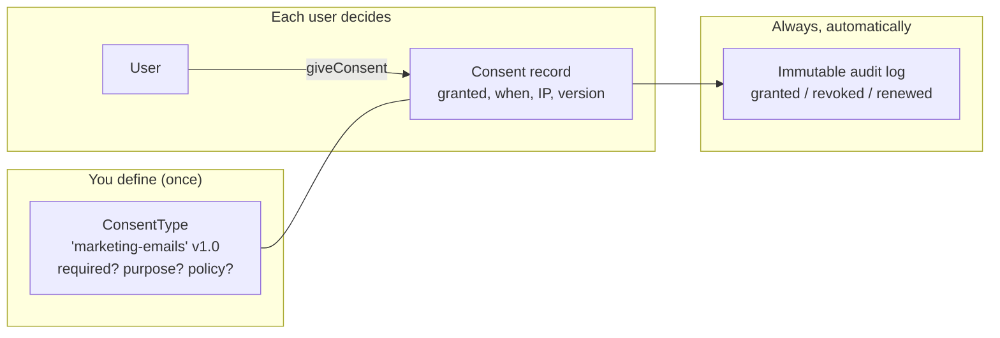

# What is GDPR consent? (start here)

If you have never dealt with privacy law before, **read this page first**. It explains the idea behind the
package, the legal thinking you'll reuse on every other page, and defines every piece of jargon in one place.
Nothing here assumes you are a lawyer.

::: callout warning "Not legal advice"
This package — and these docs — help you *implement* compliance correctly. They are not legal advice. The
final word on what your application must do belongs to your Data Protection Officer (DPO) or legal counsel.
:::

## The problem GDPR consent solves

The **GDPR** (General Data Protection Regulation) is the EU law that governs how you may use people's
**personal data** — any information about an identifiable person: their email, their IP address, what they
clicked, an analytics cookie, and so on.

To process that data lawfully you need a **legal basis**. The GDPR lists six of them (Art. 6); **consent** is
one. When you rely on consent, the person must have *actively agreed* to a *specific* use of their data —
think "Yes, you may send me marketing emails."

The catch is that the law is strict about what counts as valid consent, and — crucially — about your ability
to **prove** it later. This is where most home-grown solutions fail: they store a single boolean
`marketing = true` and call it a day. That cannot answer the questions a regulator (or the user) will ask:

- *When* did they consent, and to *which version* of the policy?
- Was it freely given, or pre-ticked?
- Can they withdraw it as easily as they gave it?
- Six months later, can you **demonstrate** all of the above?

::: callout info "In plain words"
Think of this package as a **notary** for consent. Every time a user says "yes" or "no", the notary writes
an entry in a tamper-evident ledger: who, what, which version, when, from where. Later, if anyone asks "did
this person really agree, and to what exactly?", you open the ledger and show them. The boolean flag is just
the sticky note; the ledger is the proof.
:::

## What makes consent *valid* (the four words to remember)

Article 4(11) of the GDPR defines consent as a **freely given, specific, informed and unambiguous** wish.
In practice that means:

1. **Freely given** — no pre-ticked boxes, no "you must accept to use the site" for non-essential things.
   The user can say no without penalty.
2. **Specific** — one consent per *purpose*. "Marketing emails" and "analytics cookies" are separate
   decisions, not one blanket "I agree".
3. **Informed** — the user saw *what* they were agreeing to (a policy, a description) before deciding.
4. **Unambiguous** — a clear affirmative action (ticking, clicking "Accept"), never silence or inactivity.

And two more rules that shape the whole package:

- **Art. 7(1) — you must be able to demonstrate consent.** The burden of proof is on *you*. This is why the
  package keeps an [immutable audit trail](/concepts/audit-trail).
- **Art. 7(3) — withdrawal must be as easy as giving consent.** This is why revoking is a first-class,
  one-call operation, and why the cookie banner's *Reject All* genuinely withdraws.

::: callout note "Glossary — every term, once"
- **Data subject** — the person the data is about (your user/visitor).
- **Personal data** — anything identifying them (email, IP, cookie id, …).
- **Processing** — any use of that data (storing, sending, profiling).
- **Legal basis** — your lawful reason to process (consent is one of six).
- **Consent** — a freely given, specific, informed, unambiguous "yes".
- **Purpose** — *what* the consent is for (marketing, analytics, terms…).
- **Controller** — the entity deciding why/how data is processed (usually you).
- **Withdrawal / revocation** — the user taking their "yes" back.
- **Audit trail** — the immutable log proving what happened and when.
- **Erasure (right to be forgotten)** — the user asking you to delete their data (Art. 17).
- **ePrivacy** — the EU "cookie law" that sits on top of GDPR for cookies/tracking.
:::

## How this package models all of that

The package turns those legal ideas into three concrete things you work with:

1. A **consent type** — the definition of *one thing* a user can consent to (a purpose). For example
   "Marketing emails". It carries everything the law cares about: a description (informed), whether it is
   required, a **version** (so you can prove *which* policy was agreed), an optional validity period, and
   Art. 30 record-keeping fields (`legal_basis`, `purpose`, `data_controller`).
2. A **consent record** — one user's decision about one consent type, with the timestamp, IP, user agent and
   the exact version they agreed to.
3. An **audit log entry** — an immutable copy of every action (granted / revoked / renewed / expired /
   anonymized), which is your Art. 7(1) proof.



## A 60-second mental model of the package

You work almost entirely through one trait you add to your model — usually `User`:

```php
use Selli\LaravelGdprConsentDatabase\Traits\HasGdprConsents;

class User extends Authenticatable
{
    use HasGdprConsents;
}
```

That single trait gives the model a complete, GDPR-aware consent API:

```php
// Record a "yes" for a specific purpose (captures version, timestamp, IP, user agent).
$user->giveConsent('marketing-emails');

// Ask whether they currently consent.
$user->hasConsent('marketing-emails');          // true / false

// Withdraw — as easy as giving (Art. 7(3)).
$user->revokeConsent('marketing-emails');

// Are all the consents you marked "required" satisfied?
$user->hasAllRequiredConsents();

// Every action above also wrote an immutable audit entry — your Art. 7(1) proof.
$user->consentAuditLogs();
```

Anonymous visitors (no account) are handled by a parallel service, the
[Guest Consent Manager](/concepts/guest-consents), and the bundled
[cookie banner](/concepts/cookie-banner) wires it all up for cookies.

## Where to go next

::: card "Follow the path"
1. **[Installation](/getting-started/installation)** — get the package into your app.
2. **[Quick Start](/getting-started/quick-start)** — your first consent type and consent in minutes.
3. **[Concepts → Architecture](/concepts/architecture)** — the data model and the thinking behind it.
4. **[Compliance → GDPR mapping](/compliance/gdpr-mapping)** — which feature satisfies which article.
:::
